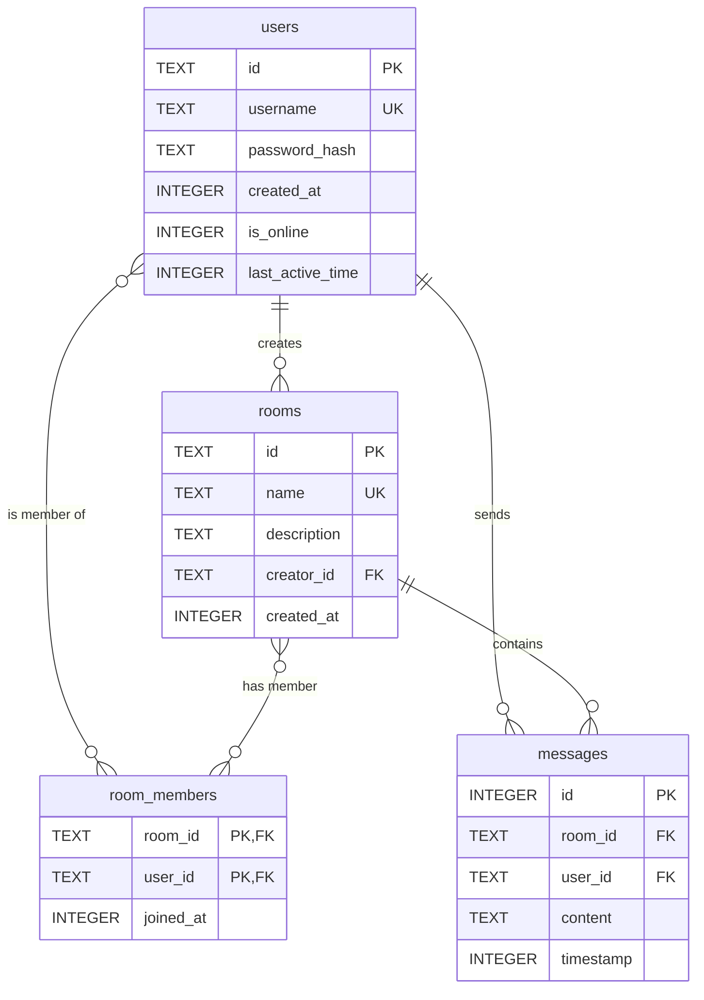

# 数据库设计文档

设计模式：仓库模式和依赖注入、外观模式

本文档详细描述了聊天应用项目所使用的 SQLite 数据库的结构、设计原则和核心功能。该数据库由 `DatabaseManager` 类进行封装和管理。

## 1\. 概述 (Overview)

本数据库旨在为一款多用户、多聊天室的实时聊天应用提供持久化存储。它负责管理用户信息、聊天室信息、成员关系以及聊天消息。

  * **数据库系统**: SQLite 3
  * **核心实体**:
    1.  **用户 (Users)**: 应用的注册用户。
    2.  **聊天室 (Rooms)**: 用户可以加入并聊天的群组。
    3.  **聊天室成员 (Room Members)**: 记录用户和聊天室之间多对多关系的中间表。
    4.  **消息 (Messages)**: 用户在聊天室中发送的消息。
  * **设计亮点**:
      * **ID 作为主键**: 所有核心实体（用户、聊天室）都使用一个唯一的、随机生成的字符串ID (`id`) 作为主键，而不是使用可变的用户名或房间名。这大大增强了系统的健壮性，即使用户或房间改名，也不会破坏表之间的关联关系。
      * **线程安全**: 所有数据库操作都通过 `std::recursive_mutex` 加锁，确保在多线程环境下的数据一致性和安全性。
      * **防SQL注入**: 所有数据插入和查询都使用了 `sqlite3_prepare_v2` 和 `sqlite3_bind_*` 系列函数，有效防止了 SQL 注入攻击。
      * **索引优化**: 为频繁查询的字段（如 `username` 和 `room_name`）建立了索引，以提高查询性能。

## 2\. 数据库表结构 (Schema)

数据库包含以下四个核心表：

### 2.1. `users` 表

存储用户的基本信息和状态。

| 字段名 (Column) | 数据类型 (Type) | 约束 (Constraints) | 描述 (Description) |
| :--- | :--- | :--- | :--- |
| `id` | `TEXT` | `PRIMARY KEY` | 用户的唯一标识符 (例如: `user_a1b2c3d4`)。 |
| `username` | `TEXT` | `UNIQUE NOT NULL` | 用户的显示名称，必须唯一。 |
| `password_hash` | `TEXT` | `NOT NULL` | 存储用户密码的哈希值。 |
| `created_at` | `INTEGER` | `NOT NULL` | 账户创建时间的 Unix 时间戳 (nanoseconds)。 |
| `is_online` | `INTEGER` | `DEFAULT 0` | 标记用户是否在线 (0: 离线, 1: 在线)。 |
| `last_active_time` | `INTEGER` | `DEFAULT 0` | 用户最后一次活跃的 Unix 时间戳 (nanoseconds)。 |

### 2.2. `rooms` 表

存储聊天室的基本信息。

| 字段名 (Column) | 数据类型 (Type) | 约束 (Constraints) | 描述 (Description) |
| :--- | :--- | :--- | :--- |
| `id` | `TEXT` | `PRIMARY KEY` | 聊天室的唯一标识符 (例如: `room_x1y2z3w4`)。 |
| `name` | `TEXT` | `UNIQUE NOT NULL` | 聊天室的显示名称，必须唯一。 |
| `description` | `TEXT` | `DEFAULT ''` | 聊天室的描述信息。 |
| `creator_id` | `TEXT` | `NOT NULL, FOREIGN KEY` | 创建该聊天室的用户ID。外键，关联 `users(id)`。 |
| `created_at` | `INTEGER` | `NOT NULL` | 聊天室创建时间的 Unix 时间戳 (nanoseconds)。 |

### 2.3. `room_members` 表

这是一个**连接表 (Junction Table)**，用于表示用户和聊天室之间的多对多关系。

| 字段名 (Column) | 数据类型 (Type) | 约束 (Constraints) | 描述 (Description) |
| :--- | :--- | :--- | :--- |
| `room_id` | `TEXT` | `PRIMARY KEY, FOREIGN KEY` | 聊天室的ID。外键，关联 `rooms(id)`。 |
| `user_id` | `TEXT` | `PRIMARY KEY, FOREIGN KEY` | 用户的ID。外键，关联 `users(id)`。 |
| `joined_at` | `INTEGER` | `NOT NULL` | 用户加入该聊天室的 Unix 时间戳 (nanoseconds)。 |

**说明**: `(room_id, user_id)` 组成一个复合主键，确保一个用户在一个聊天室里只有一条成员记录。

### 2.4. `messages` 表

存储所有聊天消息。

| 字段名 (Column) | 数据类型 (Type) | 约束 (Constraints) | 描述 (Description) |
| :--- | :--- | :--- | :--- |
| `id` | `INTEGER` | `PRIMARY KEY AUTOINCREMENT` | 每条消息的唯一自增ID。 |
| `room_id` | `TEXT` | `NOT NULL, FOREIGN KEY` | 消息所属聊天室的ID。外键，关联 `rooms(id)`。 |
| `user_id` | `TEXT` | `NOT NULL, FOREIGN KEY` | 消息发送者的用户ID。外键，关联 `users(id)`。 |
| `content` | `TEXT` | `NOT NULL` | 消息的文本内容。 |
| `timestamp` | `INTEGER` | `NOT NULL` | 消息发送的 Unix 时间戳 (nanoseconds)。 |

## 3\. 索引 (Indexes)

为了加速常用查询，定义了以下索引：

  * `CREATE INDEX IF NOT EXISTS idx_users_username ON users(username);`
      * **目的**: 快速通过用户名查找用户，例如在登录 (`validateUser`) 或检查用户是否存在 (`userExists`) 时。
  * `CREATE INDEX IF NOT EXISTS idx_rooms_name ON rooms(name);`
      * **目的**: 快速通过房间名查找聊天室，例如在获取房间列表或检查房间是否存在时。

## 4\. 实体关系图 (ERD - Conceptual)



## 5\. 潜在的改进与建议

您的数据库设计已经非常扎实，但仍有一些可以考虑的扩展方向：

1.  **级联删除 (Cascading Deletes)**:

      * **问题**: 当前设计下，如果一个用户或聊天室被删除，相关的记录（如成员关系、消息）会成为“孤儿数据”。
      * **建议**: 在定义外键时，可以添加 `ON DELETE CASCADE` 规则。例如，当一个 `room` 被删除时，自动删除 `room_members` 和 `messages` 中所有与该 `room_id` 相关的记录。
        ```sql
        -- 示例
        CREATE TABLE messages (
            -- ... 其他字段
            FOREIGN KEY(room_id) REFERENCES rooms(id) ON DELETE CASCADE,
            FOREIGN KEY(user_id) REFERENCES users(id) ON DELETE CASCADE
        );
        ```

2.  **软删除 (Soft Deletes)**:

      * **问题**: 直接使用 `DELETE` 语句会永久删除数据，不利于数据恢复或审计。
      * **建议**: 可以在 `users` 和 `rooms` 表中增加一个 `is_deleted` (或 `deleted_at`) 字段。删除操作变为 `UPDATE` 操作，将该标志位置位。所有查询都需要增加 `WHERE is_deleted = 0` 的条件。

3.  **消息功能扩展**:

      * 可以为 `messages` 表增加 `message_type` 字段（如 `text`, `image`, `file`, `system_notification`）来支持多媒体消息。
      * 可以增加一个 `message_read_status` 表来跟踪消息已读回执。

-----

总的来说，这是一个非常专业和可靠的数据库设计，为您的C++聊天项目奠定了坚实的基础。如果您有关于代码实现、项目扩展或其他任何相关问题，随时都可以提出来！